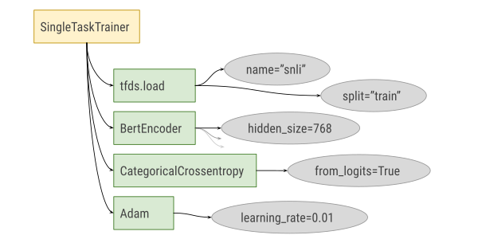
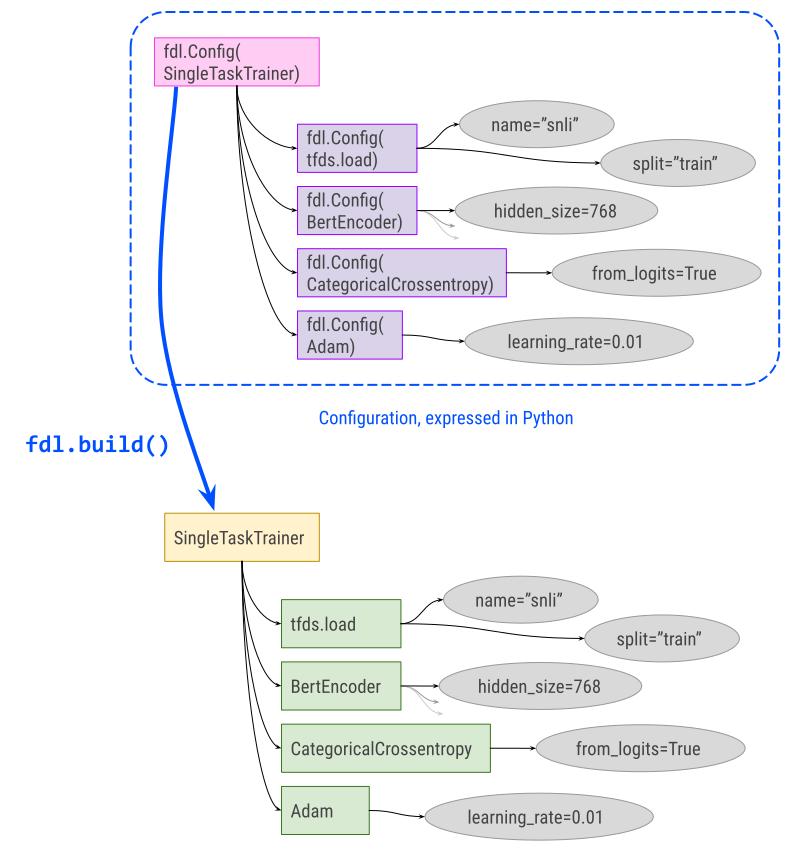
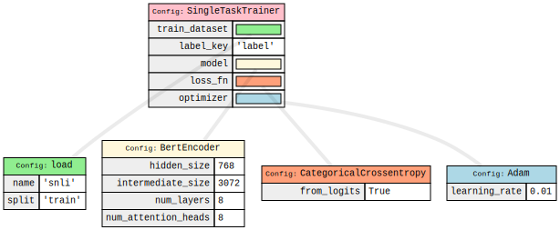

# Fiddle

<!--#include file="google/index_header.md"-->

Fiddle is a Python-first configuration library particularly well suited to ML
applications. Fiddle enables deep configurability of parameters in a program,
while allowing configuration to be expressed in readable and maintainable Python
code.

<!--#include file="google/index_links.md"-->

## Getting started

This doc provides a short overview of Fiddle, including some motivations and
design goals. For a more in-depth and hands on introduction, we recommend
getting started with the [tutorial Colabs](colabs.md).

## Design goals

Fiddle attempts to satisfy the following design goals:

*   **Python first**: Configurations are expressed naturally in Python code, and
    represented as Python objects. A Python first approach allows configs to
    leverage Python's extensive existing tooling to simplify testing and
    maintenance.

*   **Readability & understandability**: Configurations can be written almost as
    if configurability wasn't a requirement, making the structure of a
    configuration easy to read. Fiddle additionally provides visualization and
    printing tools to make configurations easy to understand.

*   **Minimal boilerplate**: Configurations don't require extensive forwarding
    of parameters, or definitions and references spread across multiple files.
    Changing one hyperparameter anywhere in the program is just a single line of
    code.

*   **Isolation & modularity**: Fiddle allows your library code to remain
    unaware of what configuration system is being used, and doesn't require
    decoration or cooperation on the part of library code. Library code should
    expose parameters as standard constructor and function arguments instead of
    relying on config objects.

*   **Universality & compatibility**: Fiddle configurations can be used to
    represent all of a Python program's configuration, avoiding the need for
    separate configuration systems for different program components. Fiddle
    additionally provides bridges to other existing configuration systems such
    as Gin and Lingvo Params.

## Motivation: code vs. configuration

Many codebases naturally split into library code (layers, optimizers, datasets,
etc) and "glue code" that calls into the libraries and wires everything
together. For example, a (very minimal) ML training setup might look something
like this:

```python
def build_trainer():
  dataset = tfds.load('snli', split='train')
  model = networks.BertEncoder(
      hidden_size=768,
      intermediate_size=3072,
      num_layers=8,
      num_attention_heads=8)
  optimizer = tf.optimizers.Adam(learning_rate=0.01)
  loss_fn = tf.losses.CategoricalCrossentropy(from_logits=True)
  trainer = trainers.SingleTaskTrainer(
      train_dataset=dataset,
      label_key='label',
      model=model,
      loss_fn=loss_fn,
      optimizer=optimizer)
  return trainer
```

Glue code like this generally doesn't contain complex logic, and instead
involves constructing instances and calling functions to build up a tree (or,
more precisely, DAG) of objects encapsulating the desired setup for a particular
experiment.

Code like this is easy to read, and has the benefit of consolidating many of a
program's parameters into the same function or file. However, creating
variations to run experiments becomes challenging: changing the number of
layers, using a different optimizer, switching the loss, etc, requires either
point changes to the code itself (which can be hard to track and reproduce) or
forking a potentially substantial amount of code to change one parameter. In
short, small changes to the parameters of an experiment can't be expressed via
small changes to the code.

While many config systems have been built to address this, existing systems such
as flags or [ConfigDict][config_dict] often require a lot of "parameter
plumbing" at call sites, which increases boilerplate (parameters must be both
defined and referenced), while more substantial changes (e.g. switching
optimizers) often add additional complexity. Existing [Gin Config][gin_config]
employs a domain-specific language for configuration, which hampers readability
and maintainability and can be limiting and inflexible for some use cases. Other
systems such as [Lingvo Params][lingvo_params] require intrusive changes to all
libraries to be configured.

Fiddle instead captures the call structure of the glue code in an unevaluated
and mutable form. This allows a base setup for experiments to be defined once
using Python, while still permitting additional experiments to modify any aspect
of the base configuration in a way that concisely highlights what particular
aspect of the setup is being changed.

[config_dict]: https://github.com/google/ml_collections#configdict
[gin_config]: https://github.com/google/gin-config
[lingvo_params]: https://github.com/tensorflow/lingvo/blob/5a4e96011201423b38df8a4aa6b9939d5f454a9d/lingvo/core/hyperparams.py

## An example

If we look at the `build_trainer()` example above, the final trainer object
produced can be represented via a graph (in this case a tree, more generally a
directed acyclic graph):



A Fiddle configuration consists of a hierarchical, mutable data structure
composed of `fdl.Config` objects (and collections) mirroring this structure:

```python
def build_trainer_config():
  dataset = fdl.Config(tfds.load, 'snli', split='train')
  model = fdl.Config(
      networks.BertEncoder,
      hidden_size=768,
      intermediate_size=3072,
      num_layers=8,
      num_attention_heads=8)
  optimizer = fdl.Config(tf.optimizers.Adam, learning_rate=0.01)
  loss_fn = fdl.Config(tf.losses.CategoricalCrossentropy, from_logits=True)
  trainer = fdl.Config(
      trainers.SingleTaskTrainer,
      train_dataset=dataset,
      label_key='label',
      model=model,
      loss_fn=loss_fn,
      optimizer=optimizer)
  return trainer
```

The resulting `fdl.Config` object can then be passed to `fdl.build()` to
construct the corresponding object hierarchy.

```python
trainer_config = build_trainer_config()
# Without modifying trainer_config, the `fdl.build()` call below will produce a
# trainer object that is equivalent to the one returned by `build_trainer()`.
trainer = fdl.build(trainer_config)
```

Graphically:



### Avoiding boilerplate with `auto_config`

The above example demonstrates how to manually create a `fdl.Config` graph by
directly constructing the `fdl.Config` instances with appropriate parameters. As
configs become longer and more complex, this approach can become tedious and
less readable than the original code in `build_trainer`. Fiddle provides an
`auto_config` utility to automatically convert a **control-flow free** function
constructing a graph of objects into a corresponding graph of `fdl.Config`
objects. With `auto_config`, a `fdl.Config` could instead be created from the
original `build_trainer` function via

```python
from fiddle.experimental import auto_config

trainer_config = auto_config.auto_config(build_trainer).as_buildable()
```

Alternatively, `auto_config` can be used as a decorator. For more details and
documentation, please see the [`auto_config` colab][auto_config_colab].

[auto_config_colab]: https://colab.sandbox.google.com/github/google/fiddle/examples/colabs/auto_config.ipynb

## Modifying a configuration

One of the key affordances of ML configuration systems is that they allow deep
overrides. The `fdl.Config` returned by `build_trainer_config()` is mutable, so
for example, if a different experiment wanted to use more layers and change the
optimizer, one way to do this would be as follows:

```python
def build_trainer_config_big_sgd():
  trainer = build_trainer_config()
  trainer.model.num_layers = 12
  trainer.optimizer = fdl.Config(tf.optimizers.SGD, learning_rate=0.1)
  return trainer
```

To recap, we have created a nested structure of `fdl.Config` objects, where each
`fdl.Config` object has a function or class that it’s configuring. When we call
`fdl.build()`, the function is called or the class is initialized, with any
arguments’ `fdl.Config` sub-objects recursively substituted with their
correspondingly built values.

## Additional features

### Support for partials

The `fdl.Partial` class transforms into a `functools.partial` instance when
built, allowing configuration of partial functions (and additionally classes,
using a custom `partialclass` type).

### Printing, codegen, and visualization

Fiddle provides tools to print out textual representations of a config, generate
Python code that would construct a given config, and visualize configs. A
visualization of the example from above:



### Command line flags

Fiddle provides command-line flag integration, allowing settings specified via
command line flags to be applied to a given config.

### Mutation history

Each `fdl.Buildable` (`fdl.Config` or `fdl.Partial`) instance retains a full
history of mutations (including file and line number information to preserve the
location where the mutation occurred). This can be visualized to understand how
a configuration was constructed.
